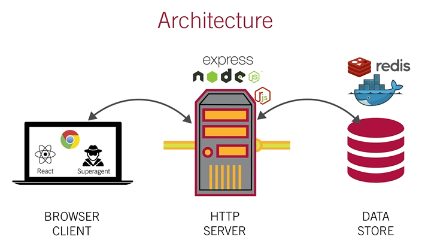

<h1></h1>

# Holy Grail App Project
> MIT xPRO - Week 25

This project was part of the course work required in the MIT xPRO Full-Stack development course taken.

## Description

A basic project to design a full-stack application that renders a 'Holy Grail' front end layout.

### Features

* Full front end Holy Grail Layout
* Linkages from the Browser Client through the HTTP server to the Data Store
* Packages used:
- React
- SuperAgent
- Express
- Node.js
- Docker
- Redis

## Installation

Clone the files that are in the Holy Grail App directory to your local machine.
To do this complete the following steps:
- run `npm install` in the root folder in order to install all dependencies
- start your Docker daemon
- run the main index file by running `node index.js`
- Once is it running, you can open your browser and navigate to the following site:
    - http://localhost:3000   
- To quit the application you can use `Ctrl + c`

## Support

If by some unexpected circumstance the data stops rendering, please get hold of me at gman.international@gmail.com and I will make it all right again.

## Roadmap

Not sure yet...

## Versioning

Version 1.1.1

## License

Copyright (c) 2021 Gregory Shaw

Permission is hereby granted, free of charge, to any person obtaining a copy
of this software and associated documentation files (the "Software"), to deal
in the Software without restriction, including without limitation the rights
to use, copy, modify, merge, publish, distribute, sublicense, and/or sell
copies of the Software, and to permit persons to whom the Software is
furnished to do so, subject to the following conditions:

The above copyright notice and this permission notice shall be included in all
copies or substantial portions of the Software.

THE SOFTWARE IS PROVIDED "AS IS", WITHOUT WARRANTY OF ANY KIND, EXPRESS OR
IMPLIED, INCLUDING BUT NOT LIMITED TO THE WARRANTIES OF MERCHANTABILITY,
FITNESS FOR A PARTICULAR PURPOSE AND NONINFRINGEMENT. IN NO EVENT SHALL THE
AUTHORS OR COPYRIGHT HOLDERS BE LIABLE FOR ANY CLAIM, DAMAGES OR OTHER
LIABILITY, WHETHER IN AN ACTION OF CONTRACT, TORT OR OTHERWISE, ARISING FROM,
OUT OF OR IN CONNECTION WITH THE SOFTWARE OR THE USE OR OTHER DEALINGS IN THE
SOFTWARE.

## Team
* [Greg Shaw](https://github.com/greg4shaw)
